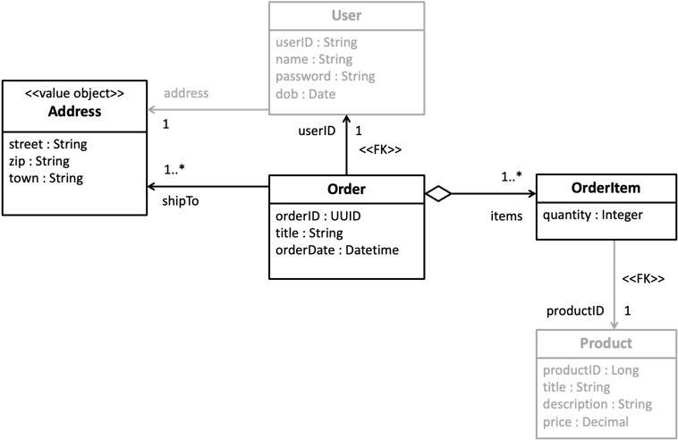

# Übung zu RESTful Webservices

Es soll ein *OrderService* mit einer REST-Schnittstelle mit Hilfe von JAX-RS-Annotationen in Java erstellt werden.

Folgendes Datenmodell ist gegben:



Erstelle zuerst die notwendigen Java-Klassen `Adresse`, `Order` und `OrderItem` für die Geschäftsobjekte,
die als Parameter übertragen werden. Achte auf die notwendigen Anforderungen (Annotationen, Konstruktor, Getter-Setter-Pärchen).

Erstelle dann eine Klasse `OrderService` im Package `service`, die die wichtigsten *CRUD-Operationen* zum 
Anlegen, Ändern, Löschen und Abrufen von *Orders* implementiert.

Die *Orders* sollen zunächst nur "in-memory" in einer `Map<UUID, Order>` gespeichert werden. 
Lege dazu folgendes statisches Attribut an:

```java
private static Map<UUID, Order> orders = new ConcurrentHashMap<>();
```

Achte auf eine nachvollziehbare Logik bei den Pfaden. Es soll *Level 2* des 
[*Richardson Maturity Model*](https://martinfowler.com/articles/richardsonMaturityModel.html)
erreicht werden.

Was müsste man tun, um `OrderItem`s einzeln hinzufügen, ändern oder löschen zu können?

Was versteht man unter *Convenience-Pfade* bzw. *Alternativ-Pfade* und was wären Beispiele 
dafür im Kontext dieses *Order-Service*? 